<div align="center">

> **Note:** The work is in progress and the repo is subjected to change.

# Learned Control Barrier Functions for Pose‑Generalizing Safe Steering from Expert Demonstrations

**A learned demonstration flow + a composite neural barrier that keeps a needle out of critical tissue —
under obstacles at new *poses*, in *deforming* environments, and around *moving* obstacles.**

`Neural ODE flow`  •  `PointNet set encoder`  •  `smooth‑min composite CBF`  •  `CLF–CBF‑QP safety filter`  •  `exact analytic backstop`

</div>

---

## 1 · Overview

We learn a safe steering policy for a needle‑tip from a handful of expert demonstrations and deploy it behind a real‑time safety filter. The system has two learned certificates and one nominal flow, all trained jointly, and a layered online controller:

$$
\dot{x} \;=\; \underbrace{f_\theta(x,s)}_{\text{demonstration flow}} \;+\; \underbrace{u(x)}_{\text{QP safety correction}},
\qquad x \in \mathbb{R}^{3}, \; s\in[0,1]\ \text{task progress.}
$$

* **$f_\theta$ — progress‑conditioned dynamical system.** Reproduces the demonstrated corridor: the *entire demo path* is an attractor, not just the goal.
* **$V_\theta$ — quadratic control‑Lyapunov function** $V(e)=\lVert e\rVert^2\,(1+\delta\,\text{corr})$ that certifies convergence back to the demonstration.
* **$B_\phi$ — composite neural barrier** built from a **permutation‑invariant PointNet encoder** and a single shared conditional CBF, fused by a **smooth‑min**. This is the piece that generalizes to obstacles at **unseen poses, scales, and even unseen shapes**, and to **slowly changing environments**.
* **Online controller** — a CLF–CBF quadratic program (OSQP), a discrete‑step projection on the learned barrier, and an **exact analytic SDF backstop** that provides the hard, non‑learned safety guarantee.

The needle is steered in a 2‑D plane at a fixed corridor height; the safe Cartesian velocity is realized on the Franka FR3 through damped‑least‑squares Jacobian IK.

---

## 2 · Results

Every rollout below is closed‑loop under the full controller. The **red** region is the critical tissue, the **light‑red band** is the $\Delta=10\,\text{mm}$ tolerance buffer, and the **purple dashed contour** is the *learned* barrier level set $B_\phi=0$, re‑evaluated at every control step. In all nine rollouts the needle keeps $\geq 11\,\text{mm}$ clearance **and** reaches the goal.

### 2.1 · Positional generalization — obstacles at new positions

The barrier was **not** retrained for these layouts; the same $B_\phi$ is conditioned on the current obstacle set. Scenes have 4, 5 and 6 critical structures at randomized poses.

| 4 obstacles | 5 obstacles | 6 obstacles |
|:---:|:---:|:---:|
| 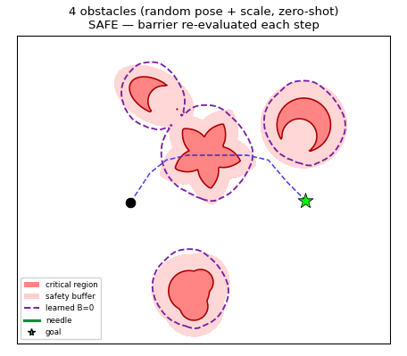 | 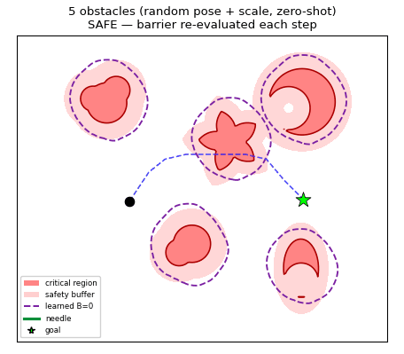 | 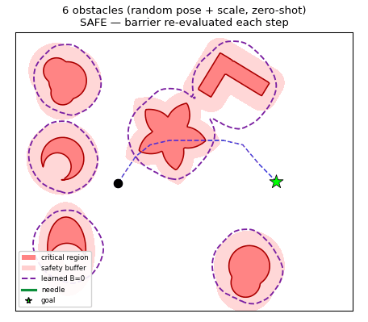 |

### 2.2 · Dynamic environments — obstacles that deform in place

The environment changes *while* the needle steers. The learned $B_\phi=0$ contour tracks the deformation because the barrier conditions on the live point‑cloud of each structure.

| Expanding | Shrinking | Expanding + rotating |
|:---:|:---:|:---:|
| 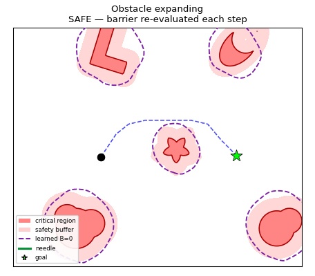 | 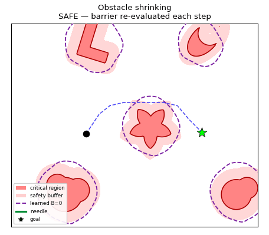 | 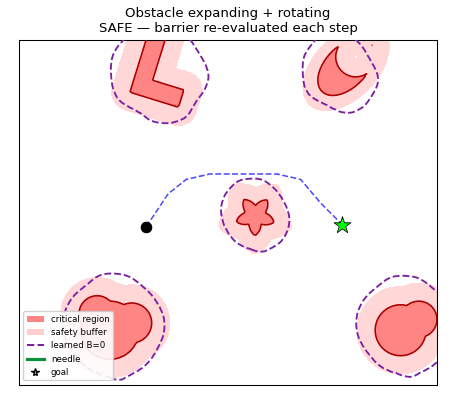 |

### 2.3 · Moving environments — obstacles that translate / rotate

The go‑around guidance steers to the side *opposite* an obstacle's heading so the needle is not chased into a corner.

| Translation | Rotation | Translation + rotation |
|:---:|:---:|:---:|
| 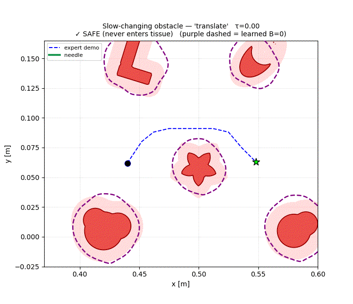 | 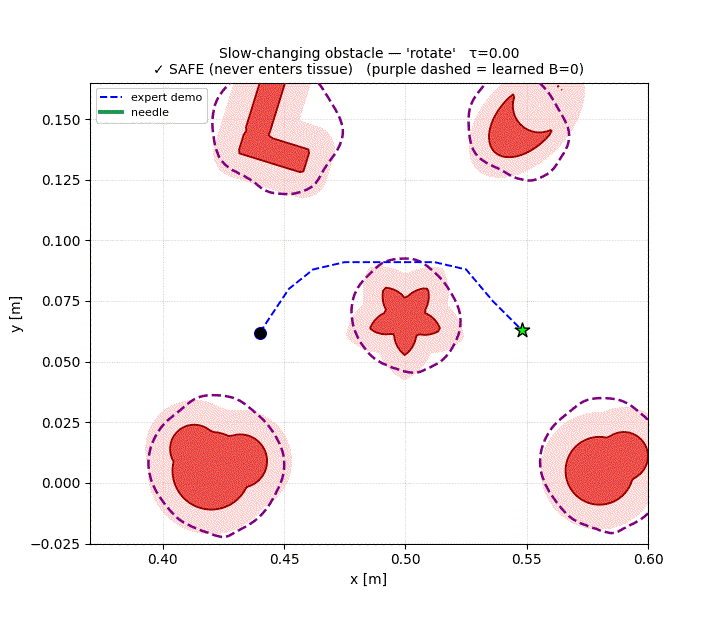 |  |

### 2.4 · Baselines & zero‑shot novel‑shape generalization

<table>
<tr>
<td width="50%" valign="top">

**Safety vs. reachability on 36 held‑out generalization scenes** (higher is better).

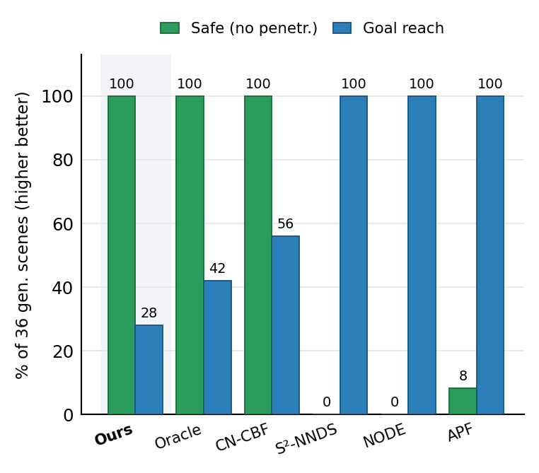

The three QP‑filtered methods (**Ours, analytic Oracle, CN‑CBF**) are the only ones that never penetrate. The pure learned‑DS baselines (**S²‑NNDS, NODE, APF**) reach the goal but do so **through** the tissue.

</td>
<td width="50%" valign="top">

**Zero‑shot novel‑shape barrier fidelity** — unsafe states correctly flagged (higher is better).

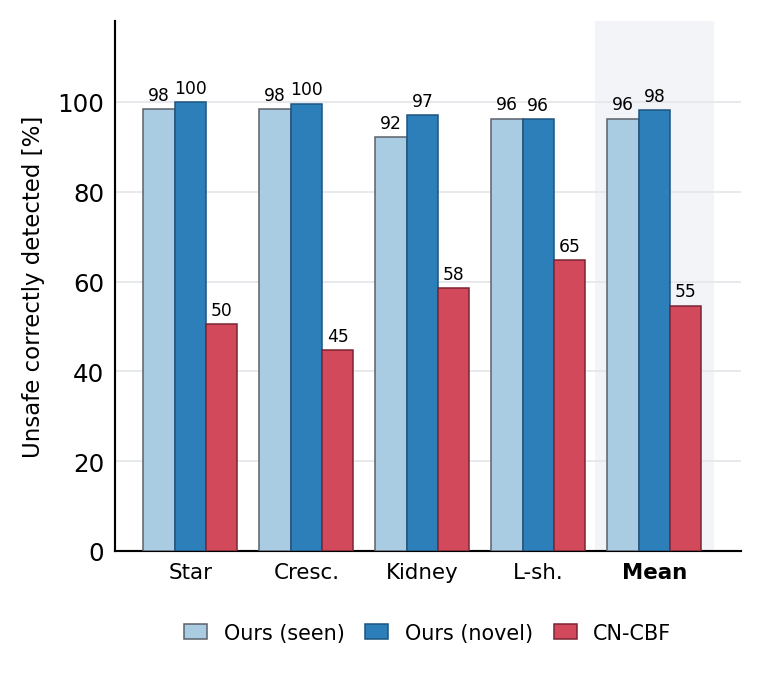

Trained under leave‑one‑shape‑out, our barrier flags **98 %** of unsafe states on shapes it has **never seen** (vs. 96 % on seen shapes) — because the PointNet encoder generalizes over shape. A per‑shape CN‑CBF has no encoder and collapses to **55 %** on the wrong net.

</td>
</tr>
</table>

| Method | Safe (no penetration) | Goal reach | Barrier | Filter |
|---|:---:|:---:|---|---|
| **Ours (composite $B_\phi$)** | **100 %** | 28 % | learned, shape‑independent | CLF–CBF‑QP + analytic |
| Analytic‑SDF Oracle | 100 % | 42 % | exact SDF (privileged) | CLF–CBF‑QP + analytic |
| CN‑CBF (per‑shape nets) | 100 % | 56 % | learned, per‑shape | CLF–CBF‑QP + analytic |
| S²‑NNDS | 0 % | 100 % | co‑trained, deployed as pure DS | none |
| NODE | 0 % | 100 % | none | none |
| APF | 8 % | 100 % | analytic potential | none |

> The reach gap is the price of a **hard** guarantee: the QP‑filtered methods trade some conservatism for zero penetrations. Our differentiator is **not** being safest among safe methods (they tie at 100 %), it is being safe **while** the barrier generalizes zero‑shot to unseen shapes — where the per‑shape CN‑CBF fails.

---

## 3 · Architecture

### 3.1 · System overview

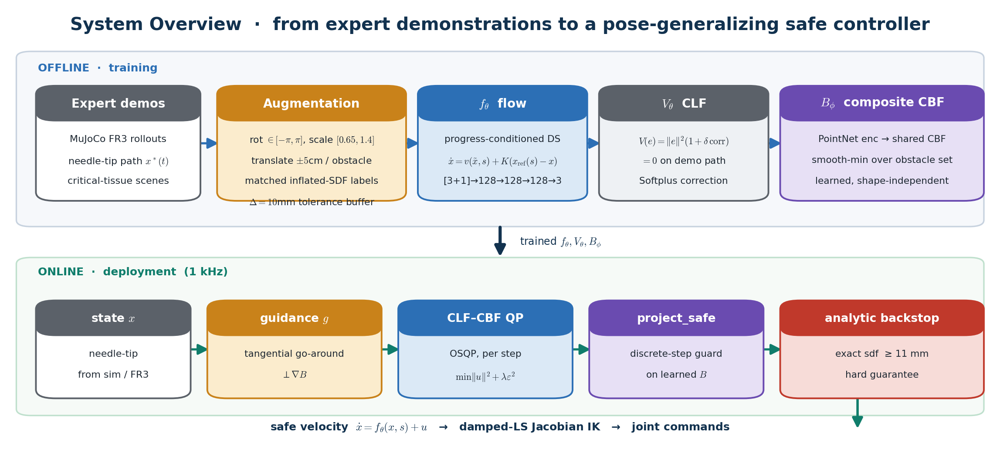

### 3.2 · Composite neural barrier $B_\phi$

The barrier is the technical core. For each obstacle $i$ we encode its point‑cloud into a shape embedding, evaluate a **single shared** conditional CBF on the relative coordinate, and fuse over the obstacle *set* with a smooth‑min:

$$
e_i = \underset{k}{\text{max-pool}}\;\text{MLP}(P_{i,k}) \in \mathbb{R}^{64},
\qquad
b_i(x) = \text{CBF}\!\left(\tfrac{x-c_i}{\sigma},\, e_i\right),
\qquad
B(x) = -\frac{1}{\beta}\,\log\sum_{i} e^{-\beta\, b_i(x)}.
$$

* **Permutation invariant** (max‑pool over points) ⇒ works for any point ordering and any cloud size.
* **One shared network** serves any *number* of obstacles; obstacle identity enters only through $e_i$ and the relative coordinate — so translation is free and pose/scale are handled by augmentation.
* **Smooth‑min** ($\beta=1000$) is a conservative under‑approximation of $\min_i b_i$, so the composite safe set never exceeds the union of the per‑obstacle safe sets. With $\ln(6)/\beta \approx 1.8\,\text{mm} \ll \Delta$, the fusion bias is negligible against the $10\,\text{mm}$ buffer.

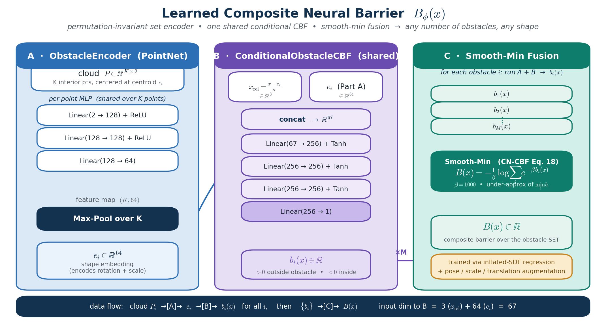

### 3.3 · Online safety filter

Every control step runs four stages. Stages (a)–(c) use the **learned** barrier; stage (d) is an **exact analytic** backstop that turns the soft learned guarantee into a hard one.

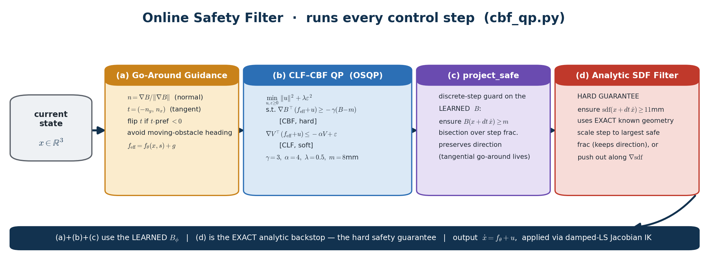

The quadratic program solved at each step is

$$
\min_{u,\;\varepsilon\geq 0}\; \lVert u\rVert^{2} + \lambda\,\varepsilon^{2}
\quad\text{s.t.}\quad
\begin{cases}
\nabla B_\phi^{\top}\,(f_{\text{eff}} + u) \;\geq\; -\gamma\,(B_\phi - m) & \text{[CBF, hard]}\\[4pt]
\nabla V^{\top}\,(f_{\text{eff}} + u) \;\leq\; -\alpha\,V + \varepsilon & \text{[CLF, soft]}
\end{cases}
$$

with $f_{\text{eff}} = f_\theta(x,s) + g$, where $g$ is a tangential go‑around term ($g \perp \nabla B$) that breaks head‑on deadlocks without fighting the barrier.

---

## 4 · Learned field & barrier

<table>
<tr>
<td width="55%" valign="top">

**Closed‑loop safety field** $\dot{x}=f_\theta(x)+u_{\text{safe}}(x)$. Streamlines divert around every light‑red CBF zone and re‑converge onto the black demonstration path — the whole demo is an attractor, so disturbed states flow *back onto the corridor* rather than only toward the goal.

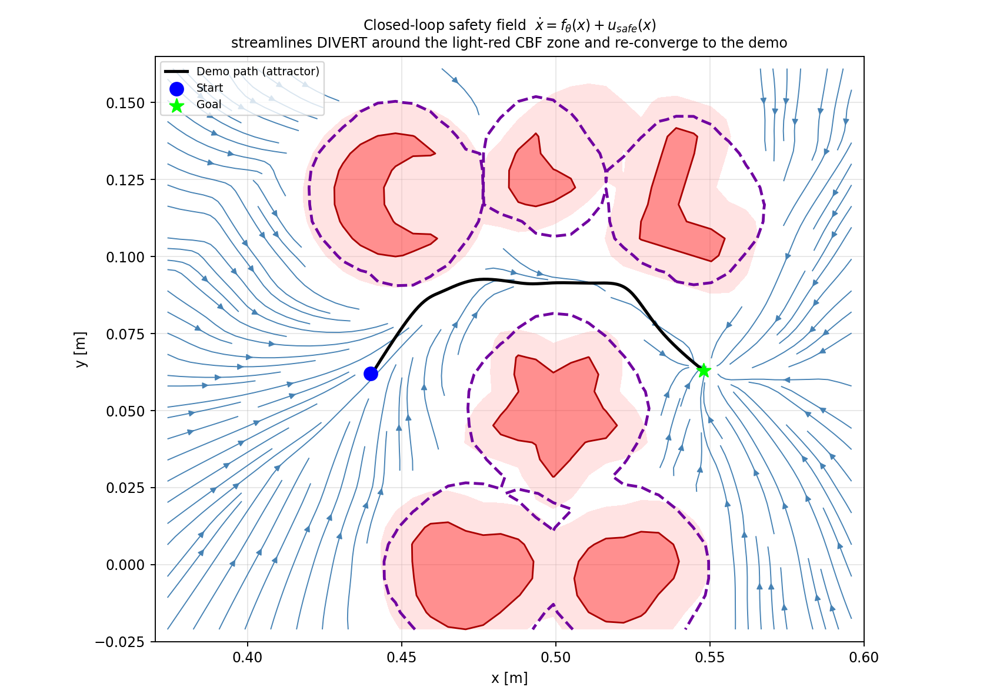

</td>
<td width="45%" valign="top">

**Learned barrier field** $B_\phi(x)$ over the scene. The zero level set (barrier boundary) sits a $10\,\text{mm}$ buffer *outside* each solid tissue, exactly matching the inflated‑SDF training target.

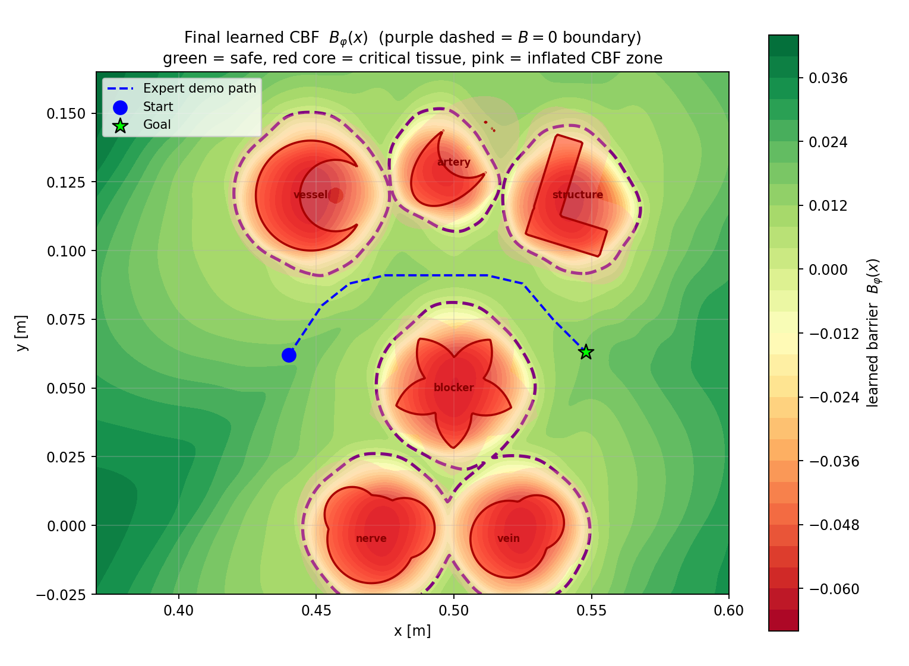

</td>
</tr>
</table>

---

## 5 · Training

Training follows the S²‑NNDS joint scheme: **Phase 0** pre‑trains the flow $f_\theta$ alone on a Neural‑ODE rollout (imitation) loss for 300 epochs, then $f_\theta$, $V_\theta$ and $B_\phi$ are trained jointly. Each inner step draws fresh **pose / scale / translation augmentations** of every obstacle with matched inflated‑SDF labels, so the barrier sees a new layout at every step.

$$
\mathcal{L} \;=\; \lambda_{\text{mse}}\mathcal{L}_{\text{imit}} \;+\; \lambda_{V}\mathcal{L}_{\text{CLF}}
\;+\; \underbrace{\lambda_{\text{reg}}\mathcal{L}_{\text{SDF}} \;+\; \lambda_{\text{fs}}\mathcal{L}_{\text{safe}} \;+\; \lambda_{\text{ob}}\mathcal{L}_{\text{unsafe}} \;+\; \lambda_{\dot B}\mathcal{L}_{\dot B} \;+\; \lambda_{\text{eik}}\mathcal{L}_{\text{eik}}}_{\text{barrier terms}}
$$

| Full joint training | Barrier convergence |
|:---:|:---:|
| 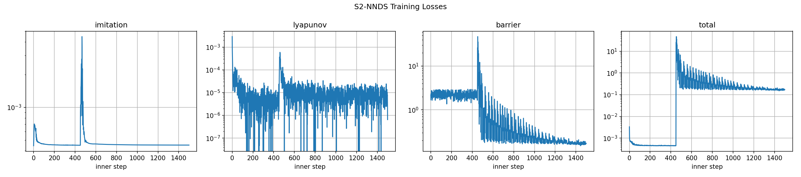 | 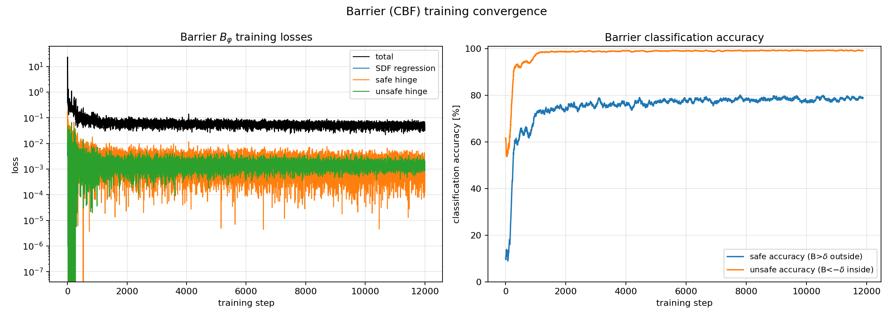 |

The spike near step ~450 is the Phase‑0 → joint transition (barrier terms switch on). The barrier's **interior (unsafe) accuracy converges to ≈ 99 %**; the **safe accuracy plateaus near ≈ 78 %** *by design* — the $10\,\text{mm}$ inflation deliberately labels the buffer band as not‑safe, so a lower "safe" number is the conservative behaviour we want, not an error.

### Key hyperparameters

| Group | Values |
|---|---|
| Networks | $f_\theta$: $[3{+}1]\!\to\!128\!\to\!128\!\to\!128\!\to\!3$ · $V_\theta$: $64\!\to\!64$ + Softplus · encoder: $2\!\to\!128\!\to\!128\!\to\!64$ · conditional CBF: $67\!\to\!256\!\to\!256\!\to\!256\!\to\!1$ |
| CLF–CBF‑QP | $\gamma=3.0$, $\alpha=4.0$, $\lambda=0.5$, barrier margin $m=8\,\text{mm}$ |
| Safety | analytic backstop margin $=11\,\text{mm}$, inflation $\Delta=10\,\text{mm}$, smooth‑min $\beta=1000$ |
| Augmentation | rotation $[-\pi,\pi]$, scale $[0.65,1.4]$, translation $\pm5\,\text{cm}$ per obstacle |
| Optimization | Phase‑0 300 epochs · 10 outer iters · $dt=0.01\,\text{s}$ · OSQP `warm_start`, `polish` |

---

## 6 · Directory structure (for reproducibility)

```
Tolerance_Aware_CBF(TA-CBF)/
├── src/
│   ├── models.py               # f_θ, V_θ, B_φ  (ProgressConditionedDS, LyapunovNet,
│   │                           #   ObstacleEncoder → ConditionalObstacleCBF → CompositeBarrier)
│   ├── cbf_qp.py               # online controller: CLF–CBF‑QP + project_safe + analytic filter
│   ├── train.py                # S²‑NNDS joint training + augmented barrier loss
│   ├── config.py               # all hyperparameters, obstacle geometry, SDF utilities
│   ├── simulate.py             # MuJoCo FR3 closed‑loop simulation
│   ├── make_gifs.py            # the result GIFs in this README
│   ├── make_final.py           # generalization / dynamic result figures
│   ├── generalization_test.py  # positional generalization protocol
│   ├── dynamic_env_test.py     # deforming / moving obstacle protocol
│   └── analytical_sdf.py       # exact SDF backstop geometry
├── baselines/
│   ├── common/                 # shared runner, metrics, scene generator, evaluator
│   ├── b1_no_filter … b9_s2nnds/   # REAL reimplementations (NODE, S²‑NNDS, CN‑CBF, APF, …)
│   ├── canonical/              # benchmark JSON + fig_baselines_grouped.py + reports
│   └── novel_shape/            # leave‑one‑shape‑out barriers + fig_novel_shape.py
├── ablations/                  # augmentation & eikonal ablations + figures
├── checkpoints/                # trained weights (.pt)
├── data/                       # expert demonstrations
├── assets/                     # FR3 MuJoCo model, obstacle meshes
└── results/                    # generated figures & rollouts

github_documentation/           # ← this folder
├── README.md
├── make_arch_figs.py           # regenerates the three architecture diagrams below
├── architecture/               # system_pipeline · composite_barrier · online_controller
├── positional_augmentation/    # gen_4obs · gen_5obs · gen_6obs  (.gif)
├── dynamic_obstacles/          # expanding · shrinking · expanding_rotating  (.gif)
├── moving_obstacles/           # dynamic_translate · dynamic_rotate · dynamic_transrotate  (.gif)
├── losses_from_training/       # full_training_losses · barrier_training  (.png)
├── final_vector_field.png
├── final_learned_cbf.png
└── results/                    # fig_baselines_grouped · fig_novel_shape  (.png)
```

### Reproduce

```bash
# environment
python3 -m venv venv && source venv/bin/activate
pip install torch osqp scipy numpy matplotlib mujoco imageio

# 1) train  (Phase 0 flow → joint f_θ, V_θ, B_φ with pose/scale augmentation)
python src/train.py

# 2) closed-loop MuJoCo simulation on the FR3
python src/simulate.py

# 3) regenerate the result GIFs and figures
python src/make_gifs.py
python github_documentation/make_arch_figs.py     # the architecture diagrams

# 4) baselines & ablations
python baselines/run_full.py --verify
python ablations/eval_ablations.py
```

---

## 7 · What makes it generalize

| Design choice | What it buys |
|---|---|
| **PointNet set encoder** | shape embedding $e_i$ is permutation‑invariant and size‑agnostic → **zero‑shot to unseen shapes** |
| **Relative coordinate $x-c_i$** | translation is free → obstacles at any *position* need no retraining |
| **Pose / scale augmentation** | one network covers all in‑plane rotations and a $0.65\!-\!1.4\times$ scale range |
| **Smooth‑min fusion** | any *number* of obstacles from one shared CBF; conservative under‑approximation |
| **$10\,\text{mm}$ inflated‑SDF target** | the learned $B=0$ contour sits a tolerance buffer *outside* the tissue |
| **Exact analytic backstop** | converts the soft learned certificate into a **hard** geometric guarantee |

---

<div align="center">

*All diagrams in §3 are rendered directly from the code by [`make_arch_figs.py`](github_documentation/make_arch_figs.py) and are faithful to `src/models.py` and `src/cbf_qp.py`.*

</div>
